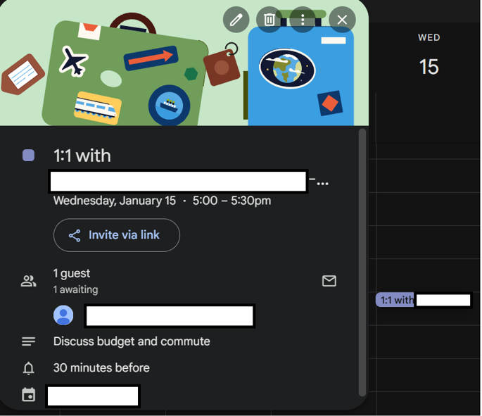
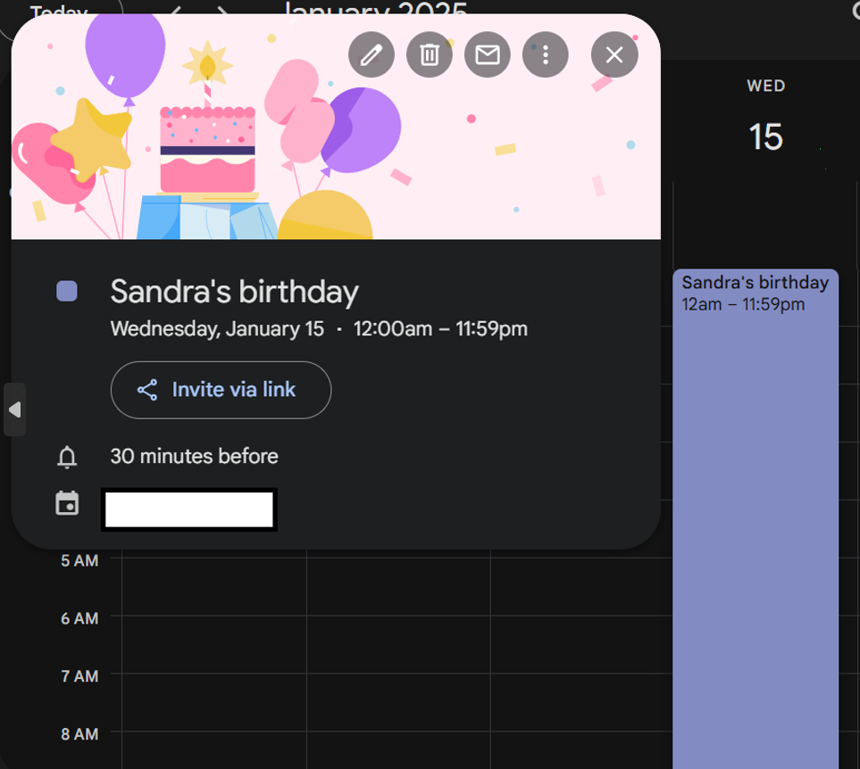
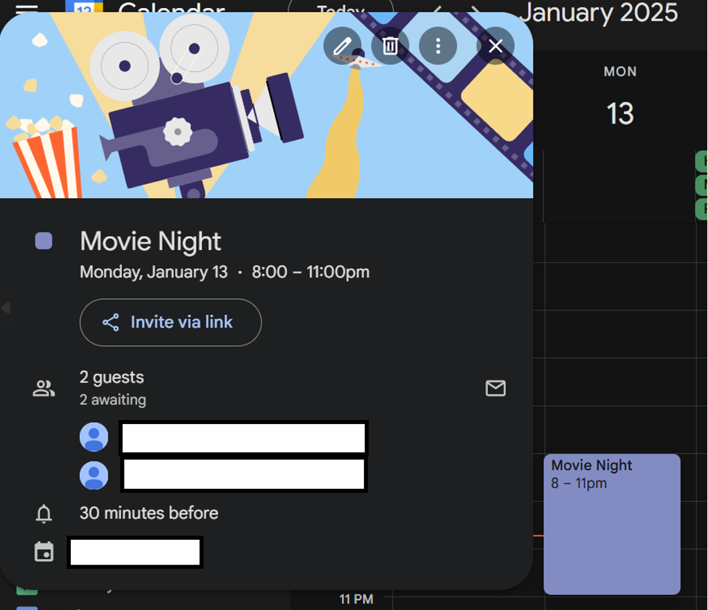

## Jarvis


Jarvis is a personal AI assistant designed to help you manage your day-to-day events and calendar. It leverages Google Calendar API and a gemini AI model to provide a seamless experience.

### Features

- **Google Calendar Integration**: Fetch, manage and create calendar events.
- **Conversational AI**: Interact with Jarvis using natural language.
- **Memory Management**: Keeps track of the conversation context.

### Upcoming
- **More Calendar Features**: Modifying events, Checking conflicts, Scheduling OOO & Focus Time, event attachments & files and more!
- **Web UI**: User friendly UI to interact with **Jarvis**.


For now, Jarvis can be used from terminal
### Installation

1. Clone the repository:
    ```sh
    git clone https://github.com/Ashwin-1709/jarvis.ai
    cd jarvis
    ```

2. Install the required dependencies:
    ```sh
    pip install -r requirements.txt
    ```

3. Set up your API keys:
    - Follow the steps required for obtaining authorization for Google Calendar APIs from [Google Cloud Console](https://developers.google.com/calendar/api/quickstart/python#enable_the_api)
    - Create Gemini API key from [Google AI Studio](https://aistudio.google.com/apikey)
    - Create a `.env` file in the root directory.
    - Add your GEMINI_API_KEY and other necessary configurations:
        ```
        GEMINI_API_KEY=your_google_api_key
        ```

### Usage

1. Run the Jarvis assistant:
    ```sh
    python jarvis.py
    ```

2. Interact with Jarvis through the command line.

## Jarvis in action

```
Hi! Just like every Tony Stark needs a Jarvis,
Just like every Harvey Spectre needs a Donna,
I am Jarvis, your personal 🤖 assistant helping you tackle your day to day events and managing your calendar.
Fire away any problems you have!

> Hi Jarvis, what are the next 2 meetings I have?

Looking for your upcoming events, Please wait...
Here are your next 2 meetings:
1. Trip Planning, 11th Jan, 10pm - 12am
2. Weekly Friday Sync, 17th Jan, 11.30pm - 1.30am

> what are the calendars I have?
Fetching your calendar list, Please wait...
Here are your calendars:
1. Primary
2. Birthdays
3. Holidays in India

> Do I have any conflicts in next 4 meetings?
Looking for your upcoming events, Please wait...
Based on your next 4 meetings, there are no conflicts.

> Do I have any meetings with sriram after 2 days? 
Fetching upcoming meetings, Please wait...
Yes, you have two meetings with sriram after 2 days: Weekly Friday Sync on 24th Jan, 11pm - 1:30am and Trip Planning on 25th Jan, 10pm - 12am.

> Who will be i meeting in for the weekly friday sync?
Looking for your upcoming events, Please wait...
Besides you, <redacted> will be in the Weekly Friday Sync.

> meetings I have after 2 months
Fetching upcoming meetings, Please wait...
Here are your meetings after 2 months:

*   Flight to <redacted> on March 13th, 7:55pm - March 14th, 3am
*   Flight to <redacted> on March 14th, 7am - 8:10am
*   Weekly Friday Sync on March 14th, 11pm - March 15th, 1:30am

> do I have any events on 13th march?
You have one event on March 13th, 2025:  "Flight to <redacted>".  The details are from an automatically created event from a Gmail email.

> am I free between 3 and 9 am on 14th march?
No, you're not completely free between 3 AM and 9 AM on March 14th. You have a meeting, "Flight to <redacted>", scheduled from 7:00 AM to 8:10 AM.

> Thanks Jarvis, I am done

Goodbye, will see you again 👋
```

## Creating events

### 1:1s
```
> Schedule a 1:1 with redacted@gmail.com for trip planning. Agenda is to discuss budget and commute.
When would you like to schedule this 1:1 meeting?  Please provide a date and time, or a range of times that work for you.  I'll also need to know how long you'd like the meeting to last.

> On 15th jan 5 pm would sound good
How long should the meeting be?

> 30 mins should be fine

Creating a new event, Please wait...

Perfect. I've scheduled a 30-minute 1:1 meeting with redacted@gmail.com in your calendar for January 15th at 5:00 PM. The description includes "Discuss budget and commute".
```


</br>

### Birthdays

```
> Add an event for Sandra's birthday for 15th Jan

Done. I've added an event to your calendar for Sandra's birthday on January 15th.
```

</br>

### Other events

```
> Create a 3 hour movie night event for 8 pm 13th Jan with redacted1@gmail.com & redacted2@gmail.com

Creating a new event, Please wait...
OK. I've added a "Movie Night" event to your calendar from 8 pm to 11 pm on January 13th.  redacted1@gmail.com and redacted2@gmail.com are included.
```


